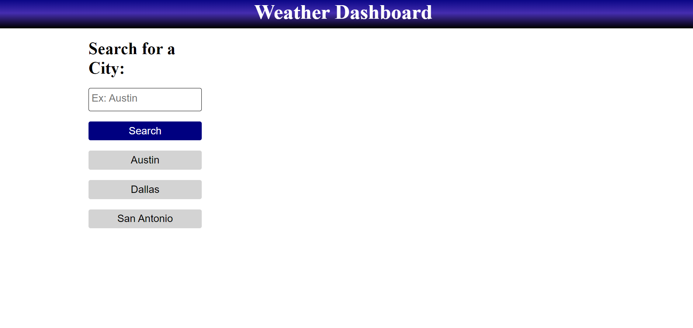
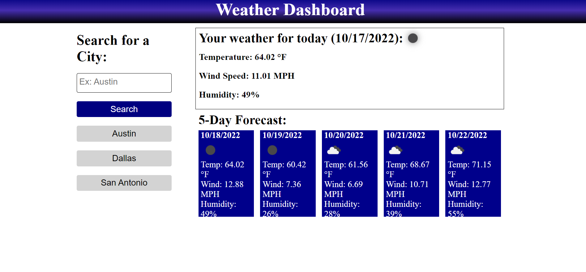
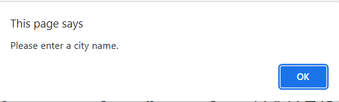
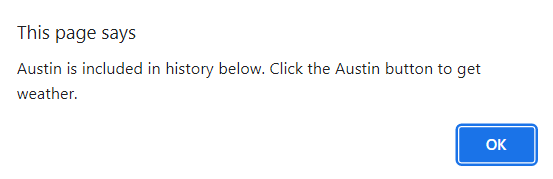

# Weather-Dashboard

## Description

This weather dashboard was created using integrated web development elements including HTML, CSS, JQuery, and public web API's. Weatherbit.io API was used to obtain coordinates for entered cities due to deactivated functionality with open weather map, and open weather map API was used to obtain current weather conditions and weather forecast using the reverse-searched coordinates.

## Usage

On page open, the screen will have a search box and previously entered city names.

Clicking on city names or searching a city will display the current weather conditions, as well as a weather forecast for the next 5 days. Temperatures listed are in increments of 24 hours from the current time.

If a user does not make an input, a window alert will prompt the user to enter a city name to use the function.

If a user attempts to search a city already saved into local storage, a window alert will prompt them to click the generated history button.

## Credits

API's referenced in this project:
Weatherbit.io: https://www.weatherbit.io/api/weather-current
Open weather map (current weather): https://openweathermap.org/current
Open weather map (forecast): https://openweathermap.org/forecast16

## License

Refer to license in repo or as below:

MIT License

Copyright (c) 2022 jimmehhuang

Permission is hereby granted, free of charge, to any person obtaining a copy of this software and associated documentation files (the "Software"), to deal in the Software without restriction, including without limitation the rights to use, copy, modify, merge, publish, distribute, sublicense, and/or sell copies of the Software, and to permit persons to whom the Software is furnished to do so, subject to the following conditions:

The above copyright notice and this permission notice shall be included in all copies or substantial portions of the Software.

THE SOFTWARE IS PROVIDED "AS IS", WITHOUT WARRANTY OF ANY KIND, EXPRESS OR IMPLIED, INCLUDING BUT NOT LIMITED TO THE WARRANTIES OF MERCHANTABILITY, FITNESS FOR A PARTICULAR PURPOSE AND NONINFRINGEMENT. IN NO EVENT SHALL THE AUTHORS OR COPYRIGHT HOLDERS BE LIABLE FOR ANY CLAIM, DAMAGES OR OTHER LIABILITY, WHETHER IN AN ACTION OF CONTRACT, TORT OR OTHERWISE, ARISING FROM, OUT OF OR IN CONNECTION WITH THE SOFTWARE OR THE USE OR OTHER DEALINGS IN THE SOFTWARE.